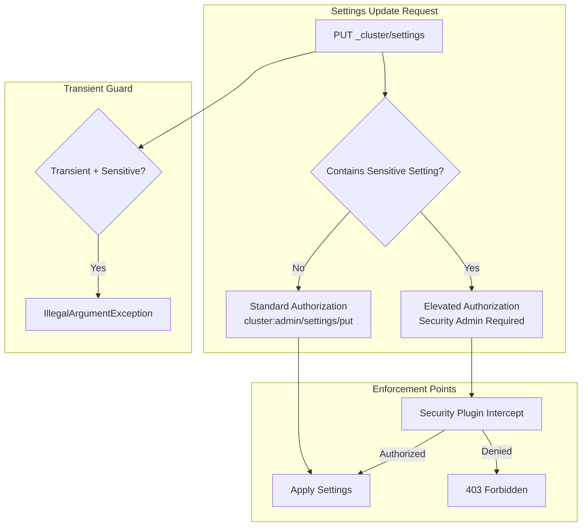

---
tags:
  - opensearch
---
# Dynamic Settings Authorization

## Summary

OpenSearch v3.6.0 introduces a new `Setting.Property.Sensitive` property that enables tiered authorization for dynamic cluster settings. Settings marked as `Sensitive` require elevated privileges (e.g., security admin) to update, while non-sensitive dynamic settings continue to use the standard `cluster:admin/settings/put` permission. This provides a first-class mechanism in OpenSearch core for plugins like the Security plugin to distinguish between ordinary and privileged settings updates.

## Details

### What's New in v3.6.0

A new `Sensitive` value has been added to the `Setting.Property` enum. This property can only be applied to dynamic settings (a validation error is thrown if applied to non-dynamic settings). The property serves as metadata that plugins can inspect to enforce different authorization policies.

### Technical Changes

#### New `Setting.Property.Sensitive` Enum Value

The `Setting.Property` enum in `Setting.java` gains a new `Sensitive` entry:

```java
/**
 * Marks a setting as sensitive. Can only be applied to dynamic settings.
 * The Sensitive property has default enforcement but enables plugins to implement
 * different policies for these settings. In practice the security plugin will
 * require higher privileges for modifying sensitive settings.
 */
Sensitive
```

#### Validation: Sensitive Must Be Dynamic

When constructing a `Setting`, if `Sensitive` is specified without `Dynamic`, an `IllegalArgumentException` is thrown:

```
sensitive setting [<key>] must be dynamic
```

#### `isSensitive()` Method on `Setting`

A new `isSensitive()` method returns `true` if the setting has the `Sensitive` property, allowing callers to check authorization tier at runtime.

#### `isSensitiveSetting(String key)` on `AbstractScopedSettings`

A new method on `AbstractScopedSettings` (parent of `ClusterSettings`) allows looking up whether a registered setting key is sensitive:

```java
public boolean isSensitiveSetting(String key) {
    final Setting<?> setting = get(key);
    return setting != null && setting.isSensitive();
}
```

#### Transient Settings Restriction

`SettingsUpdater.updateSettings()` now validates that sensitive settings cannot be updated via transient settings. Attempting to do so throws:

```
sensitive setting [<key>] must be updated using persistent settings
```

This ensures sensitive settings are always persisted and survive cluster restarts.

### Authorization Flow



### Companion Security Plugin Changes

The companion PR in the Security plugin (opensearch-project/security#6016) uses this new property to make `plugins.security.dfm_empty_overrides_all` dynamically toggleable while requiring security admin privileges. The Security plugin inspects the `Sensitive` property on settings update payloads and enforces that only users with `all_access` or `security_manager` roles can modify sensitive settings.

## Limitations

- The `Sensitive` property can only be applied to dynamic settings; static settings cannot be marked sensitive
- Default enforcement in core only blocks transient updates; the actual elevated authorization is implemented by the Security plugin
- No sensitive settings are defined in OpenSearch core itself in this release; the property is currently used by the Security plugin

## References

### Pull Requests
| PR | Description | Related Issue |
|----|-------------|---------------|
| [opensearch-project/OpenSearch#20901](https://github.com/opensearch-project/OpenSearch/pull/20901) | Add new `Sensitive` setting property for tiering dynamic settings authorization | [opensearch-project/OpenSearch#20905](https://github.com/opensearch-project/OpenSearch/issues/20905) |
| [opensearch-project/security#6016](https://github.com/opensearch-project/security/pull/6016) | Make `plugins.security.dfm_empty_overrides_all` dynamically toggleable | [opensearch-project/security#6002](https://github.com/opensearch-project/security/issues/6002) |

### Related Issues
- [opensearch-project/OpenSearch#20905](https://github.com/opensearch-project/OpenSearch/issues/20905) - Feature request: tiering dynamic cluster settings for authorization
- [opensearch-project/security#5219](https://github.com/opensearch-project/security/issues/5219) - RFC: Fine grained settings permissions
- [opensearch-project/security#6002](https://github.com/opensearch-project/security/issues/6002) - Make `plugins.security.dfm_empty_overrides_all` dynamically toggleable
