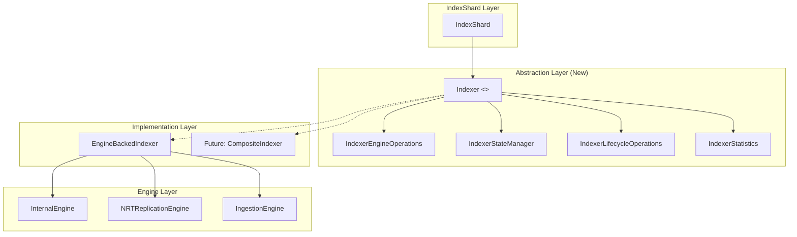

---
tags:
  - opensearch
---
# Pluggable Engine Architecture

## Summary

OpenSearch v3.6.0 introduces the `Indexer` interface, a new abstraction layer that decouples `IndexShard` from the `Engine` class. This is the foundational step (Phase 1) toward enabling pluggable and composite engine architectures, allowing OpenSearch to support multiple storage formats (e.g., Parquet, ORC, Arrow) alongside Lucene in the future. A concrete implementation, `EngineBackedIndexer`, wraps the existing `Engine` to preserve full backward compatibility.

## Details

### What's New in v3.6.0

This PR introduces a clean abstraction boundary between `IndexShard` and the underlying storage engine. Previously, `IndexShard` held a direct reference to `Engine` and called engine methods throughout its lifecycle, tightly coupling shard-level coordination logic to a single engine implementation.

### Architecture

### New Classes and Interfaces

#### Core Indexer Interface (`org.opensearch.index.engine.exec`)

| Class | Description |
|-------|-------------|
| `Indexer` | Unified interface combining engine operations, state management, lifecycle, and statistics. Annotated `@ExperimentalApi`. |
| `IndexerEngineOperations` | Core CRUD operations: `index()`, `delete()`, `noOp()`, `prepareIndex()`, `prepareDelete()` |
| `IndexerStateManager` | Sequence numbers, checkpoints, timestamps, and history management |
| `IndexerLifecycleOperations` | Flush, refresh, force merge, throttling, and settings changes |
| `IndexerStatistics` | Performance metrics: doc stats, segment stats, merge stats, commit stats |
| `Segment` | Segment metadata model with data-format-grouped searchable files |
| `WriterFileSet` | File set produced by a writer, grouped by directory and generation |
| `CatalogSnapshot` | Abstract base for point-in-time catalog state with reference counting |

#### Data Format Abstractions (`org.opensearch.index.engine.dataformat`)

| Class | Description |
|-------|-------------|
| `DataFormat` | Interface for storage format identity: name, priority, and supported field type capabilities |
| `DataFormatPlugin` | Plugin interface for registering custom data formats with the engine |
| `IndexingExecutionEngine` | Format-specific engine for writer creation, merging, refresh, and file management |
| `Writer` | Interface for writing documents to a specific data format |
| `DocumentInput` | Abstraction for adding fields and metadata to a writer |
| `Merger` | Interface for merging multiple writer file sets |
| `FieldTypeCapabilities` | Declares capabilities per field type (e.g., `FULL_TEXT_SEARCH`, `COLUMNAR_STORAGE`, `VECTOR_SEARCH`, `POINT_RANGE`, `STORED_FIELDS`, `BLOOM_FILTER`) |

#### Concrete Implementation

| Class | Description |
|-------|-------------|
| `EngineBackedIndexer` | Delegates all `Indexer` calls to the existing `Engine`. Provides `getEngine()` escape hatch (marked for future removal). |

### Key Changes to IndexShard

- `IndexShard` now holds `AtomicReference<Indexer>` instead of `AtomicReference<Engine>`
- `getEngine()` renamed to `getIndexer()`, `getEngineOrNull()` renamed to `getIndexerOrNull()`
- Engine creation wraps via `new EngineBackedIndexer(engineFactory.newReadWriteEngine(config))`
- Methods requiring direct `Engine` access (e.g., `acquireSearcher`, `segments()`, `get()`) use `applyOnEngine()` utility that casts `Indexer` to `EngineBackedIndexer`
- Several methods marked `@Deprecated` pending a future `SearcherInterface`

### Migration Path

| Phase | Scope | Status |
|-------|-------|--------|
| Phase 1 | Introduce `Indexer` interface, migrate `IndexShard` and `RemoteStoreRefreshListener` | **This PR (v3.6.0)** |
| Phase 2 | Deprecate `getEngine()`, introduce `SearcherInterface` | Future |
| Phase 3 | Introduce `CompositeIndexer` for multi-engine shards, `DataFormatRegistry` | Future |

## Limitations

- The `Indexer` interface is annotated `@ExperimentalApi` — the contract is expected to evolve
- `EngineBackedIndexer.getEngine()` is a temporary escape hatch for callers not yet migrated
- `applyOnEngine()` throws `IllegalStateException` for non-`EngineBackedIndexer` instances
- `acquireSnapshot()` on `EngineBackedIndexer` throws `UnsupportedOperationException` (not yet implemented)
- Search-related operations (`acquireSearcher`, `segments()`, `get()`) still require direct `Engine` access via casting

## References

### Pull Requests
| PR | Description | Related Issue |
|----|-------------|---------------|
| `https://github.com/opensearch-project/OpenSearch/pull/20675` | Add indexer interface for shard interaction with underlying engines | `https://github.com/opensearch-project/OpenSearch/issues/20644` |

### Related
- RFC: `https://github.com/opensearch-project/OpenSearch/issues/20644` — OpenSearch Engine: Pluggable Component Bundling
