---
tags:
  - opensearch
---
# Remote Store Stability

## Summary

OpenSearch v3.6.0 includes three bug fixes that improve the stability and reliability of Remote Store operations. These fixes address JVM memory exhaustion during cluster manager bootstrap with encrypted repositories, stale metadata pile-ups caused by cleanup timeout failures, and unbounded memory growth from the segments-uploaded-to-remote-store map when flushes are infrequent.

## Details

### What's New in v3.6.0

#### Fix EncryptedBlobContainer Limit Handling (PR #20514)

When Remote Cluster State repositories use S3 with encryption, the `EncryptedBlobContainer` wrapper was missing an override for `listBlobsByPrefixInSortedOrder(blobNamePrefix, limit, blobNameSortOrder)`. This caused it to fall back to the default `BlobContainer` implementation which loads all blobs into memory, sorts them, and trims to the limit. With large manifest pile-ups (~500k files), this caused severe JVM exhaustion and slow cluster manager bootstrap.

The fix adds a proper override in `EncryptedBlobContainer` that delegates directly to the underlying `S3BlobContainer` implementation, which uses S3's native lexicographic listing with a limit parameter — avoiding loading all objects into memory.

Key files changed:
- `EncryptedBlobContainer.java` — Added `listBlobsByPrefixInSortedOrder` override
- `BlobContainer.java` — Added warning log when fallback to in-memory sort is used

#### Fix Batched Deletion of Stale ClusterMetadataManifests (PR #20566)

The `RemoteClusterStateCleanupManager` runs every ~5 minutes to clean up stale cluster metadata from remote storage. After a 30-second timeout was added to S3 sync delete operations, large delete sets would timeout and throw `IOException`, aborting the entire cleanup run. This created a cascading failure where each subsequent run had even more files to delete.

The fix introduces multiple improvements:

| Change | Description |
|--------|-------------|
| Batched manifest deletion | Manifests are now deleted in configurable batches instead of all at once |
| Deletion order fix | Manifests are now deleted last (after index routing paths) to prevent dangling routing files |
| Version tracking fix | `lastCleanupAttemptStateVersion` is only updated after successful completion, not on failure |
| Async deletion with timeout | Uses `AsyncMultiStreamBlobContainer.deleteBlobsAsyncIgnoringIfNotExists` with a 300-second timeout |
| Logging reduction | Moved per-file delete logging from DEBUG to TRACE level |

New cluster settings:

| Setting | Description | Default |
|---------|-------------|---------|
| `cluster.remote_store.state.cleanup.batch_size` | Number of manifests to process per cleanup batch | `1000` |
| `cluster.remote_store.state.cleanup.max_batches` | Maximum number of batches per cleanup run | `3` |

#### Fix Stale Segments Cleanup Based on Map Size Threshold (PR #20976)

The `segmentsUploadedToRemoteStore` map in `RemoteSegmentStoreDirectory` tracks segments uploaded to remote. Previously, entries were only cleaned up during the first refresh after a flush/commit. When continuous refreshes happen without flushes (e.g., frequent small updates that don't trigger flush thresholds), this map grows unboundedly, causing steady JVM memory increase over days.

The fix adds a threshold-based cleanup trigger: stale segment cleanup now also fires when the map size exceeds a configurable threshold, independent of flush events.

New cluster setting:

| Setting | Description | Default |
|---------|-------------|---------|
| `cluster.remote_store.uploaded_segments_cleanup_threshold` | Map size threshold to trigger cleanup; `-1` disables | `1000` |

The threshold is validated to be either `-1` (disabled) or between `100` and `100000`.

### Technical Changes

```mermaid
flowchart TB
    subgraph "PR #20514: EncryptedBlobContainer Fix"
        A1[listBlobsByPrefixInSortedOrder called] --> A2{EncryptedBlobContainer?}
        A2 -->|Before| A3[Fallback: load ALL blobs into memory]
        A2 -->|After| A4[Delegate to S3BlobContainer with limit]
    end

    subgraph "PR #20566: Batched Cleanup"
        B1[Cleanup Timer Fires] --> B2[List batch of manifests]
        B2 --> B3[Delete global/index/ephemeral metadata]
        B3 --> B4[Delete index routing paths]
        B4 --> B5[Delete manifests last]
        B5 --> B6{More batches?}
        B6 -->|Yes, under max| B2
        B6 -->|No or max reached| B7[Update version on success only]
    end

    subgraph "PR #20976: Threshold-Based Segment Cleanup"
        C1[After Refresh] --> C2{First refresh after commit?}
        C2 -->|Yes| C4[Trigger stale segment cleanup]
        C2 -->|No| C3{Map size > threshold?}
        C3 -->|Yes| C4
        C3 -->|No| C5[Skip cleanup]
    end
```

## References

### Pull Requests

| PR | Description | Related Issue |
|----|-------------|---------------|
| [#20514](https://github.com/opensearch-project/OpenSearch/pull/20514) | Fix `listBlobsByPrefixInSortedOrder` in EncryptedBlobContainer to respect limit | [#20543](https://github.com/opensearch-project/OpenSearch/issues/20543) |
| [#20566](https://github.com/opensearch-project/OpenSearch/pull/20566) | Batched deletions of stale ClusterMetadataManifests to prevent remote storage pile-up | [#20564](https://github.com/opensearch-project/OpenSearch/issues/20564) |
| [#20976](https://github.com/opensearch-project/OpenSearch/pull/20976) | Stale segments cleanup based on map size threshold | [#20960](https://github.com/opensearch-project/OpenSearch/issues/20960) |

### Issues

- [#20543](https://github.com/opensearch-project/OpenSearch/issues/20543): EncryptedBlobContainer ignores limit for listing blobs in sorted order
- [#20564](https://github.com/opensearch-project/OpenSearch/issues/20564): Remote Cluster State cleanup failures due to deletion timeouts
- [#20960](https://github.com/opensearch-project/OpenSearch/issues/20960): Memory build up due to stale segment cleanup not triggering
