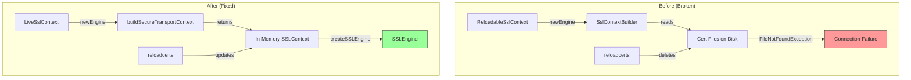

---
tags:
  - opensearch
---
# Streaming Search

## Summary

Two improvements to OpenSearch streaming search in v3.6.0: a new `streamingRequest` flag on `SearchRequestContext` for plugin observability, and a fix for TLS certificate hot-reload in the Arrow Flight transport layer.

## Details

### What's New in v3.6.0

#### Stream Request Flag in SearchRequestContext (PR #20530)

A `streamingRequest` boolean flag was added to `SearchRequestContext`, allowing plugins (such as Query Insights) to determine whether a search request was executed via the streaming path. The flag is set to `true` in `StreamSearchQueryThenFetchAsyncAction` when stream results are successfully received and consumed.

Key changes:
- `SearchRequestContext` gains `setStreamingRequest(boolean)` / `isStreamingRequest()` methods
- `AbstractSearchAsyncAction` exposes `getSearchRequestContext()` as a protected getter
- `StreamSearchQueryThenFetchAsyncAction` sets the flag in both the shard-completion and stream-completion code paths, only when `streamResultsReceived > 0`

This enables downstream plugins to emit metrics or dimensions based on whether a request used streaming.

#### Arrow Flight TLS Certificate Hot-Reload Fix (PR #20734)

Fixed a bug where Arrow Flight transport connections failed with "cert file read errors" after a `reloadcerts` operation. The root cause was that the previous `ReloadableSslContext` implementation rebuilt `JdkSslContext` from disk files on each new connection. If the security plugin's `reloadcerts` API rebuilt the in-memory `SSLContext` and then deleted the temporary cert files, subsequent connections would fail.

The fix introduces a new architecture:

- **New SPI method**: `SecureTransportSettingsProvider.buildSecureTransportContext(Settings)` returns the live in-memory `javax.net.ssl.SSLContext` directly, avoiding disk reads
- **`LiveSslContext`**: Replaces `ReloadableSslContext`. Calls `buildSecureTransportContext()` on every `newEngine()` invocation, wrapping the result in a `JdkSslContext` that delegates `createSSLEngine()` to the live context
- **`AlpnPresettingClientSslContext`**: Client-side wrapper that pre-sets ALPN protocols on the engine before gRPC-netty's `ClientTlsHandler` performs its `getSSLParameters()`/`setSSLParameters()` round-trip
- **`AlpnAwareSSLEngineWrapper`**: SSLEngine wrapper in the `io.netty.handler.ssl` package that implements Netty's package-private `ApplicationProtocolAccessor` interface and strips `endpointIdentificationAlgorithm` when hostname verification is disabled
- **Security plugin companion** (opensearch-project/security#5971): Implements `buildSecureTransportContext()` to return the live `SSLContext` from `SslContextHandler`

### Technical Changes

| File | Change |
|------|--------|
| `SecureTransportSettingsProvider.java` | Added `buildSecureTransportContext(Settings)` default method returning `Optional<SSLContext>` |
| `DefaultSslContextProvider.java` | Replaced `ReloadableSslContext` with `LiveSslContext` + `AlpnPresettingClientSslContext` |
| `AlpnAwareSSLEngineWrapper.java` | New SSLEngine wrapper for ALPN negotiation and hostname verification bypass |
| `ReloadableSslContext.java` | Removed |
| `SearchRequestContext.java` | Added `streamingRequest` flag with getter/setter |
| `StreamSearchQueryThenFetchAsyncAction.java` | Sets `streamingRequest=true` on successful stream execution |
| `AbstractSearchAsyncAction.java` | Added `getSearchRequestContext()` protected getter |

## Limitations

- The `buildSecureTransportContext()` SPI method has a default implementation returning `Optional.empty()`, so custom security plugins that do not implement it will not benefit from the hot-reload fix
- The `AlpnAwareSSLEngineWrapper` must reside in the `io.netty.handler.ssl` package to access Netty's package-private `ApplicationProtocolAccessor` interface

## References

### Pull Requests
| PR | Description | Related Issue |
|----|-------------|---------------|
| [#20530](https://github.com/opensearch-project/OpenSearch/pull/20530) | Add stream request flag to SearchRequestContext for plugin consumption | - |
| [#20734](https://github.com/opensearch-project/OpenSearch/pull/20734) | Fix stream transport TLS certificate hot-reload by using live SSLContext from SecureTransportSettingsProvider | - |
| [security#5971](https://github.com/opensearch-project/security/pull/5971) | Add buildSecureTransportContext() to security plugin for Arrow Flight TLS cert reload | - |
