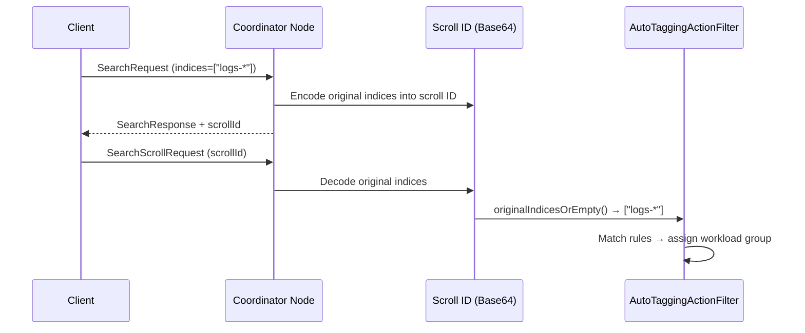

---
tags:
  - opensearch
---
# Workload Management (WLM)

## Summary

OpenSearch v3.6.0 adds three enhancements to Workload Management: per-group custom search settings (starting with `timeout`), Scroll API support for rule-based autotagging, and a bug fix for workload group creation failures caused by clock skew.

## Details

### What's New in v3.6.0

#### Custom Search Settings (`search_settings`)

Workload groups now support an optional `search_settings` field that allows administrators to define search behavior overrides applied automatically to all requests assigned to the group. This is the foundational infrastructure for per-tenant search customization in multi-tenant deployments.

The first supported setting is `timeout`, which enforces a hard upper bound on search execution time. The WLM timeout is only applied when the request does not already have an explicit timeout set, preserving caller-specified values.

```bash
# Create workload group with search_settings
PUT _wlm/workload_group
{
  "name": "analytics",
  "resiliency_mode": "enforced",
  "resource_limits": {
    "cpu": 0.1,
    "memory": 0.1
  },
  "search_settings": {
    "timeout": "30s"
  }
}

# Update search_settings
PUT _wlm/workload_group/analytics
{
  "search_settings": {
    "timeout": "1m"
  }
}
```

Key implementation details:
- New `WorkloadGroupSearchSettings` enum with validation framework for extensible settings
- `search_settings` field added to `MutableWorkloadGroupFragment` and `WorkloadGroup`
- `WorkloadGroupRequestOperationListener` applies settings during `onRequestStart`
- Settings are serialized with version gating (`Version.V_3_6_0`) for backward compatibility
- Update semantics: `null` = keep existing, empty map = clear, non-empty map = replace

#### Scroll API Support for Rule-Based Autotagging

`SearchScrollRequest` is now recognized by the `AutoTaggingActionFilter`, enabling workload management rules to tag scroll requests the same way they tag initial search requests. Previously, only `SearchRequest` was supported, meaning scroll continuations bypassed WLM autotagging.

The implementation embeds original index expressions into the scroll ID during the initial search phase, so subsequent scroll requests can recover the original indices for rule matching:



Key changes:
- `ParsedScrollId` now stores `originalIndices` array
- `TransportSearchHelper.buildScrollId()` encodes original indices (version-gated to v3.6.0+)
- `SearchScrollRequest.originalIndicesOrEmpty()` extracts indices from parsed scroll ID
- `AutoTaggingActionFilter` handles both `SearchRequest` and `SearchScrollRequest`

#### Bug Fix: Relaxed `updatedAt` Validation

Workload group creation could intermittently fail on data nodes with `WorkloadGroup.updatedAtInMillis is not a valid epoch` due to minor clock skew between data nodes and the cluster-manager node. The fix replaces the strict "not in the future" upper-bound check with a simple lower-bound epoch validation (`updatedAt > 0`).

### Technical Changes

| Component | Change |
|-----------|--------|
| `WorkloadGroupSearchSettings` | New enum-based validation framework for search settings |
| `MutableWorkloadGroupFragment` | Added `searchSettings` field with serialization, parsing, and `search_settings` XContent support |
| `WorkloadGroup` | Added `getSearchSettings()`, null-to-empty normalization, update merge logic |
| `WorkloadGroupRequestOperationListener` | Applies `timeout` from group settings when request has no explicit timeout |
| `WorkloadGroupService` | Added `getWorkloadGroupById()` for settings lookup |
| `AutoTaggingActionFilter` | Extended to handle `SearchScrollRequest` via index extraction |
| `ParsedScrollId` | Added `originalIndices` field |
| `TransportSearchHelper` | Encodes/decodes original indices in scroll ID (version-gated) |
| `SearchScrollRequest` | Added `originalIndicesOrEmpty()` and cached `ParsedScrollId` |
| `WorkloadGroup.isValid()` | Replaced upper-bound timestamp check with `updatedAt > 0` |

## Limitations

- Only `timeout` is supported as a search setting in v3.6.0; additional settings (`cancel_after_time_interval`, `max_concurrent_shard_requests`, `batched_reduce_size`, `phase_took`, `max_buckets`) are planned for future versions
- Scroll ID format changes are version-gated; mixed-version clusters with nodes older than v3.6.0 will not include original indices in scroll IDs

## References

### Pull Requests

| PR | Description | Related Issue |
|----|-------------|---------------|
| [#20536](https://github.com/opensearch-project/OpenSearch/pull/20536) | Add `search_settings` support with initial `timeout` setting | [#20555](https://github.com/opensearch-project/OpenSearch/issues/20555) |
| [#20151](https://github.com/opensearch-project/OpenSearch/pull/20151) | Add Scroll API support for rule-based autotagging | [#18362](https://github.com/opensearch-project/OpenSearch/issues/18362) |
| [#20486](https://github.com/opensearch-project/OpenSearch/pull/20486) | Relax `updatedAt` validation for workload group creation | [#20485](https://github.com/opensearch-project/OpenSearch/issues/20485) |

### Documentation

- [WLM Feature Overview](https://opensearch.org/docs/latest/tuning-your-cluster/availability-and-recovery/workload-management/wlm-feature-overview/)
- [Rule-Based Autotagging](https://docs.opensearch.org/latest/tuning-your-cluster/availability-and-recovery/rule-based-autotagging/autotagging/)
