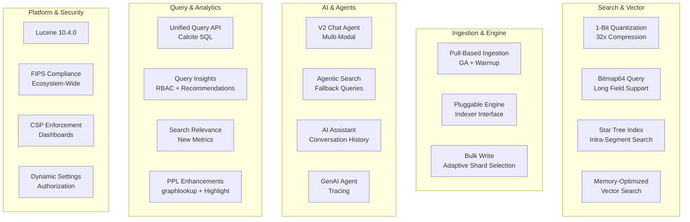

# OpenSearch v3.6.0 Release Summary

## Summary

OpenSearch v3.6.0 is a feature-rich release spanning 80 investigated areas across 30+ repositories. Headline features include 1-bit scalar quantization (32x compression) for vector search, pull-based ingestion graduating to GA, a pluggable engine architecture foundation, the V2 Chat Agent with multi-modal support, a unified SQL/PPL query API with Calcite-native planning, and a comprehensive AI Assistant overhaul in Dashboards. The release also delivers major improvements to query insights (RBAC, recommendations, remote export), APM observability, search relevance tooling, and security hardening — alongside 15+ core dependency upgrades including Lucene 10.4.0.

## Highlights

## New Features

| Feature | Description | Repository |
|---------|-------------|------------|
| 1-Bit Scalar Quantization | 32x vector compression for Lucene (BBQ) and Faiss engines with SIMD acceleration | k-nn |
| Pre-quantized Vector Search | Eliminates redundant quantization during disk-based filtered exact search and ADC | k-nn |
| Bitmap64 Query Support | Extends bitmap filtering to 64-bit long fields using Roaring64NavigableMap | opensearch |
| Pull-Based Ingestion GA | Promoted to public API with warmup phase and field_mapping message mapper | opensearch |
| Pluggable Engine Architecture | New Indexer interface decoupling IndexShard from Engine (Phase 1) | opensearch |
| Adaptive Bulk Write | Shard selection based on real-time node metrics for append-only indices (20%+ throughput) | opensearch |
| Star Tree Intra-Segment Search | Parallel metric aggregation within segments for sum, min, max, avg, stats, cardinality, value_count | opensearch |
| Dynamic Settings Authorization | New Setting.Property.Sensitive for tiered cluster settings authorization | opensearch |
| Context-Aware Indices | Immutable grouping criteria and refactored CriteriaBasedCodec delegate support | opensearch |
| ProfilingWrapper Interface | Public API for plugins to unwrap profiling decorators without reflection | opensearch |
| CCS Cluster Name Validation | Optional cluster_name setting for sniff mode remote cluster validation | opensearch |
| V2 Chat Agent | Unified registration, multi-modal input, and Strands-style I/O for conversational agents | ml-commons |
| Agentic Memory Search | Semantic and hybrid search APIs for long-term memory retrieval | ml-commons |
| Token Usage Tracking | Per-execution token tracking across Conversational, AG-UI, and PER agents | ml-commons |
| LAST_TOKEN / NONE Pooling | New pooling modes for decoder-only and pre-pooled embedding models | ml-commons |
| Agentic Search Enhancements | Custom fallback queries, alias/wildcard support, embedding model ID in translator | ml-commons, neural-search |
| Unified Query API (Calcite) | Calcite-native SQL planning, unified parser API, and profiling support | sql |
| PPL graphlookup | Bi-directional graph traversal with BFS, 5–29x faster than MongoDB on SNB benchmarks | sql |
| PPL Highlight Support | Search result highlighting via highlight API parameter | sql |
| PPL Query Cancellation | PPL queries visible in _tasks and cancellable via _tasks/_cancel | sql |
| Grammar Bundle API | Versioned ANTLR grammar bundle for client-side PPL autocomplete | sql |
| Query Insights RBAC | User/backend-role filtering for self-service query debugging | query-insights |
| Query Insights Recommendations | Rule-based recommendation engine with confidence scores | query-insights |
| Remote Repository Export | Export top N queries to S3 blob store repositories | query-insights |
| Finished Queries Cache | Recently completed queries accessible via live queries API | query-insights |
| Search Evaluation Metrics | Recall@K, MRR, and DCG@K with dynamic relevance thresholding | search-relevance |
| SearchAroundDocumentTool | Retrieve N documents before/after a target document by timestamp | skills |
| MetricChangeAnalysisTool | Detect metric changes via percentile comparison between time periods | skills |
| AI Assistant Overhaul | Conversation history, dashboard screenshots, time range tool, OBO token auth | opensearch-dashboards |
| In-Context Visualization Editor | Create and edit visualizations directly within dashboards | opensearch-dashboards |
| APM Topology Package | @osd/apm-topology with service maps, trace maps, and GenAI agent visualization | opensearch-dashboards |
| Data Importer Upload Aliases | Filtered aliases for dimensional data enrichment via discriminator field | opensearch-dashboards |
| CSP Strict Enforcement | Full Content-Security-Policy enforcement mode with nonce support | opensearch-dashboards |
| GenAI Agent Tracing UX | Discover DataTable migration, Visualization tab, Celestial Map graph | opensearch-dashboards |
| SQL/PPL Monitors (Frontend) | Lookback window moved to frontend with timestamp validation and time filter injection | alerting-dashboards |
| Terraform AD Provisioning | Declarative detector management via Terraform provider | anomaly-detection |
| Shard Operations Collector | Per-shard indexing/search rate, latency, CPU, and heap metrics | performance-analyzer |
| gRPC Basic Authentication | Basic auth support for gRPC transport alongside JWT | security |
| Configurable Max Triggers | Dynamic cluster setting for max triggers per monitor | alerting |
| Automated Investigation | Accept hypothesis, duration tracking, telemetry metrics | dashboards-investigation |
| Top N Queries Visualizations | P90/P99 stats, pie charts, heatmaps, and performance analysis | query-insights-dashboards |

## Improvements

| Improvement | Description | Repository |
|-------------|-------------|------------|
| Storage I/O Optimization | MMapDirectory uses ReadAdviseByContext for context-aware madvise | opensearch |
| Terms Aggregation Performance | Cardinality threshold guard and segment-to-global ordinal mapping fix | opensearch |
| Segment Replication Warmer | IndexWarmer support for replica shards eliminates cold start latency | opensearch |
| Telemetry Tags Immutability | Sorted-array Tags with precomputed hash for allocation-efficient metrics | opensearch |
| Node Runtime Metrics | ~30 JVM/CPU gauges via MetricsRegistry following OTel semantic conventions | opensearch |
| Request ID Validation Relaxed | X-Request-Id accepts any non-empty string up to configurable max length | opensearch |
| Search Slow Log Indices | Slow log now includes target index names/patterns | opensearch |
| Hunspell ref_path | Package-based dictionary loading with multi-tenant isolation | opensearch |
| WLM Search Settings | Per-group custom search settings (timeout) for workload management | opensearch |
| WLM Scroll Autotagging | Scroll API support for rule-based autotagging | opensearch |
| Streaming Search Flag | streamingRequest flag on SearchRequestContext for plugin observability | opensearch |
| Arrow Flight TLS Reload | LiveSslContext architecture for in-memory cert hot-reload | opensearch |
| Docker Multi-Arch | ppc64le, arm64, s390x support for Docker builds | opensearch |
| AWS CRT Fallback | S3 plugin falls back to Netty when CRT is unavailable | opensearch |
| k-NN Prefetch | Proactive vector loading for ANN and exact search (up to 2x latency improvement) | k-nn |
| k-NN FP16 Performance | 35% faster bulk similarity via precomputed tail masks | k-nn |
| k-NN Merge Policy | Less aggressive merge defaults reduce CPU contention | k-nn |
| k-NN Abortable Merges | Native engine merges can be interrupted during shard relocation | k-nn |
| k-NN Scoring Refactor | VectorScorers factory with unified scorer creation across storage formats | k-nn |
| Hybrid Query Collapse Fixes | Multiple score/ranking correctness fixes for collapse feature | neural-search |
| Hybrid Query Profiler | Profiler support for hybrid queries via ProfileScorer unwrapping | neural-search |
| ML Commons Async Encryption | Fully asynchronous encrypt/decrypt with per-tenant listener queuing | ml-commons |
| Security Index Pattern Matching | ~56% latency improvement for role configuration updates | security |
| Security FLS Optimization | getFieldFilter returns predicate only when FLS restrictions exist | security |
| SRW Multi-Data-Source | End-to-end dataSourceId support for experiments, judgments, query sets | dashboards-search-relevance |
| SRW Manual Query Sets | Create query sets directly in UI with multi-format input | dashboards-search-relevance |
| Explore Performance | Redux results cache, bulk DataView fetching, ECharts migration | opensearch-dashboards |
| APM Metrics Accuracy | Server-side filtering, throughput normalization, true percentile latency | observability |
| React 18 Migration | Cross-plugin upgrade for alerting, anomaly-detection, maps, security, index-management | multiple |
| FIPS Ecosystem Build | Default FIPS build parameter across 9 repositories with OPENSEARCH_FIPS_MODE env var | common |

## Bug Fixes

| Fix | Description | Repository |
|-----|-------------|------------|
| Remote Store Memory Exhaustion | EncryptedBlobContainer respects limit in listBlobsByPrefixInSortedOrder | opensearch |
| Remote Store Cleanup Pile-up | Batched deletion of stale ClusterMetadataManifests with proper ordering | opensearch |
| Remote Store Segment Leak | Threshold-based cleanup for segmentsUploadedToRemoteStore map | opensearch |
| Search Query Fixes | 8 fixes: copy_to geo_point, field_caps disable_objects, terms max_clause_count, wildcard concurrency, range validation, synonym_graph ordering, template collision, IndicesOptions accessor | opensearch |
| Search Performance | ExitableTerms getMin/getMax delegation, lazy SourceLookup stored field reader, HeapUsageTracker message | opensearch |
| Segment Replication Retry | Fix infinite retry loop from stale metadata checkpoint race condition | opensearch |
| Logging JSON Escape | Fix invalid JSON in task details log from unescaped metadata | opensearch |
| Upgrade Error Message | Clear error for Elasticsearch-created indices with version and UUID | opensearch |
| WLM Clock Skew | Relaxed updatedAt validation for workload group creation | opensearch |
| k-NN Derived Source | Fix vectors returned as mask value 1 with dynamic templates during bulk indexing | k-nn |
| k-NN Radial Search | Fix 0 results for IndexHNSWCagra by adding range_search override | k-nn |
| k-NN Integer Overflow | Fix MonotonicIntegerSequenceEncoder on large-scale MOS indexes | k-nn |
| k-NN Nested CAGRA | Fix duplicate entry points and incorrect second deep-dive in optimistic search | k-nn |
| k-NN Score Conversion | Fix filtered radial exact search with cosine space type | k-nn |
| k-NN Rescore TopK | Fix premature result reduction before rescoring phase | k-nn |
| Hybrid Query Nesting Block | Block hybrid query inside function_score, constant_score, script_score | neural-search |
| Rerank Nested Fields | Fix text extraction from nested and dot-notation fields in document_fields | neural-search |
| Remote Symmetric Models | Remove invalid validation blocking remote symmetric embedding models | neural-search |
| ML Commons Connection Leak | Fix SdkAsyncHttpClient resource leak causing connection pool exhaustion | ml-commons |
| ML Commons Timeout Defaults | Fix connection_timeout/read_timeout from 30000 to 30 (seconds, not ms) | ml-commons |
| ML Commons Tags Loss | Fix Tags.addTag() return value not captured after immutable Tags change | ml-commons |
| SQL Memory Leak | Fix ExecutionEngine recreated per query appending to global function registry | sql |
| SQL PIT Leak | Fix Point in Time resource leaks in v2 query engine | sql |
| Alerting SMTP Fix | Preserve user auth context when stashing thread context for notifications | alerting |
| Alerting JobSweeper | Replace _id sort with _seq_no to fix fielddata error | alerting, job |
| Security Audit Log | Fix writing errors for rollover-enabled alias indices | security |
| Security Context | Fix propagation issue for security context | security |
| Security Analytics Deletion | Fix detector deletion with empty monitor ID list | security-analytics |
| Thread Pool Starvation | Fix LLM judgment processing deadlock with BatchedAsyncExecutor | search-relevance |
| Geospatial Typo | Fix max_multi_geometries setting name | geospatial |
| LTR toXContent | Fix JsonGenerationException when LTR logging used with search pipelines | learning |
| CCR Engine Compat | Fix ReplicationEngine for strategy planner refactor | cross-cluster-replication |

## Breaking Changes

| Change | Description | Repository |
|--------|-------------|------------|
| Geospatial Setting Rename | `plugins.geospatial.geojson.max_multi_gemoetries` → `plugins.geospatial.geojson.max_multi_geometries` | geospatial |
| Notifications Settings Prefix | `plugins.alerting.*` → `plugins.notifications.*` for remote metadata settings | notifications |
| ML Commons Timeout Defaults | `connection_timeout` and `read_timeout` defaults changed from 30000 to 30 | ml-commons |
| Lucene on_disk Default | Lucene and Faiss `on_disk` mode defaults to 32x compression (1-bit SQ) for new indices | k-nn |
| Context-Aware Criteria Immutable | Grouping criteria field updates blocked with UnsupportedOperationException | opensearch |

## References

- [Official Release Notes](https://github.com/opensearch-project/opensearch-build/blob/main/release-notes/opensearch-release-notes-3.6.0.md)
- [OpenSearch Core Release Notes](https://github.com/opensearch-project/OpenSearch/blob/main/release-notes/opensearch.release-notes-3.6.0.md)
- [OpenSearch Dashboards Release Notes](https://github.com/opensearch-project/OpenSearch-Dashboards/blob/main/release-notes/opensearch-dashboards.release-notes-3.6.0.md)
- [Release Artifacts](https://opensearch.org/artifacts/by-version/#release-3-6-0)
